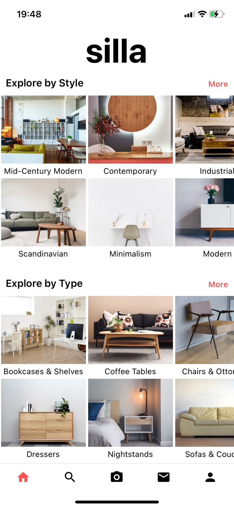

### 1. Google Login/Signup
A user can log in or sign up with their google creditials.


### 2. Explore Page/Home
A user will have a better idea what to look for by displaying popular categories. 



### 2. Messaging
Users can send messages to each other about a particular item. 
This is done with web sockets.


### 3. Creating/Updating/Deleteing Posts
Users can create posts. Images are stored in a AWS S3 bucket and all other 
post details are stored in a standard NoSQL database-- MongoDB. This includes
Image URLs that are autogenerated form AWS S3. 

<div style="display: flex">
  
  
</div>

### 4. Creating/Updating Profile
A user profile is created upon signing up and can be updated in the profile
screen. 

### 5. Search
Users can search through items via keywords or phrases. 


## Setup
We have to start our server and then run our react native
application. 

```
cd backend
npm install
npm start

cd..

cd Silla
npm install
npm run ios
```
